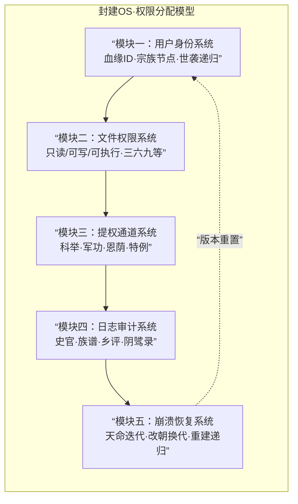

### 【模型摘要】

**封建OS**是中国帝制时代社会操作系统的底层架构。其核心特征并非“中央集权”或“君主专制”这类功能层描述，而是一套**以血缘为介质、以世袭为递归、以权限固化为目标**的信任分配协议。

本模型提出：**一切封建制度——宗法、科举、礼教、田制——本质上都是权限分配算法的不同模块实现**。读懂这套算法，就能读懂两千年帝制史的底层逻辑；而拆解这套算法，则是现代人从“被治理者”转向“主权者”的认知起点。

**模型版本**：1.0
**关联项目**：信任操作系统·成蹊
**适用场景**：前现代文明的组织形态分析、家族权力结构诊断、提权通道设计批判

---

## 一、系统架构总览

封建OS的权限分配模型由五个核心模块构成，它们共同支撑起一个**权限高度固化、迭代极其缓慢**的社会运行环境。



**系统设计哲学**：**稳定优于效率，可预测优于可突破，递归优于创新。**

这不是技术落后，这是经过两千年压力测试后收敛出的**最优解**——对于维持特定群体长期统治这一目标而言。

---

## 二、模块一：用户身份系统

### 2.1 用户ID：血缘标识符

封建OS拒绝匿名登录。每个用户从出生起即被分配一个**不可篡改、不可注销、跨代继承**的用户ID。

- **ID编码规则**：姓氏 + 郡望 + 辈分 + 嫡庶 + 排行
- **示例**：太原王氏·三槐堂·继字辈·嫡长·某
- **ID有效期**：生前有效，死后转入“祖先进程”继续占用系统资源（祭祀、荫庇）

**技术本质**：这是**生物特征绑定**的早期实现。你的权限不取决于你是谁，而取决于你的**父进程ID**。

### 2.2 用户角色：四民分业

系统将用户预置为四大角色，角色决定**默认权限集**：

| 角色 | 权限等级 | 可继承性 | 提权可能性 |
|-----|---------|---------|-----------|
| 士 | A级 | 是（嫡长） | 高（科举） |
| 农 | B级 | 是 | 中（军功） |
| 工 | C级 | 是 | 低 |
| 商 | D级 | 是 | 极低（需捐纳） |

**值得注意的是**：女性不属于这四类角色中的任何一类。女性的权限不由职业决定，而由**依附关系**决定——作为“某人之女”“某人之妻”“某人之母”获得从属账户。

### 2.3 递归算法：世袭继承

这是封建OS最核心、最精密的算法实现。

```python
def 继承权限(父进程, 子进程列表):
    if 存在嫡长子:
        嫡长子.权限 = 父进程.权限 * 0.9  # 主体权限，略有损耗
        嫡长子.角色 = 父进程.角色
        
        for 次子 in 嫡长子之后的子进程:
            次子.权限 = 父进程.权限 * 0.1  # 断崖式下跌
            次子.角色 = 降级(父进程.角色)  # 士→农，农→工
        
        for 庶子 in 非正妻所生子进程:
            庶子.权限 = 0  # 权限清零
            庶子.角色 = 依附者  # 需依附嫡系生存
    else:
        从宗族仓库中过继参数最接近的子进程
        被过继者.父进程ID = 当前进程ID
        被过继者.权限 = 父进程.权限 * 0.8  # 过继承损耗更高
    
    return 新的权限分配树
```

**算法特征**：
1. **不完全继承**：每一代必有损耗，维持系统向下流动的焦虑
2. **嫡庶隔离**：限制子进程数量对权限的摊薄效应
3. **过继机制**：确保无嫡长者仍可维持递归，防止进程中断

**社会后果**：这套递归算法制造了源源不断的“向下流动者”——他们是科举制度最忠实的用户，是每一次改朝换代最积极的支持者。

---

## 三、模块二：文件权限系统

封建OS将社会知识划分为不同的访问权限等级，形成**中国最早的ACL（访问控制列表）**。

### 3.1 权限等级定义

| 等级 | 代号 | 可读内容 | 可写权限 | 适用人群 |
|-----|-----|--------|--------|--------|
| 0级 | 只读-必读区 | 女诫、乡约、圣谕 | 无 | 女性、庶民 |
| 1级 | 只读-应用区 | 识字、算术、医卜 | 无 | 农、工、商 |
| 2级 | 只读-经典区 | 四书五经（无注） | 无 | 童生 |
| 3级 | 可读可写-注疏区 | 经史子集+朱注 | 可写注疏 | 生员、举人 |
| 4级 | 可读可写-议政区 | 奏疏、时务策 | 可写奏议 | 进士、官员 |
| 5级 | 可读可写-修史区 | 起居注、实录 | 可修国史 | 翰林、史官 |
| 6级 | 根权限 | 所有文件 | 可改祖制 | 皇帝 |

### 3.2 权限隔离机制

封建OS采用**严格的权限隔离**，低权限用户无法读取高权限文件：

- **民不见官报**：普通百姓无权阅读邸报
- **妇不窥经史**：女性阅读经史需特殊特许
- **士不议朝政**：生员举人无权接触奏疏原档

这套隔离机制的经典表述，是清代陆世仪那段被我反复引用的“技术文档”：

> **“教女子只使之识字，不可使之知书义。盖识字则可理家政，治货财，代夫之劳。若书义则无所用之。”**

——这是对“只读1级”权限的精确技术定义。

### 3.3 “只读用户”的专门设计

封建OS为女性用户设计了**专门的只读账户类型**。这类账户具有以下特征：

1. **可读取指定文件**（女教读物、家训、部分诗词）
2. **不可写入系统分区**（无权参与制度制定）
3. **不可派生递归**（学识无法作为遗产传给女儿）
4. **存储空间私有化**（樟木箱、妆奁——系统不承认的档案库）

**技术本质**：女性是系统的**永久测试用户**——她们运行着系统最重要的核心进程（生育、教育、家务、情感再生产），却从未获得开发权限。

---

## 四、模块三：提权通道系统

任何稳定的系统都必须为低权限用户提供理论上的上升路径。封建OS设计了四条提权通道，其共同特征是：**极其狭窄、成本极高、且不允许批量通过**。

### 4.1 科举通道（官方主线）

科举是封建OS**唯一公开文档化、提供标准API**的提权通道。

```c
// 科举提权伪代码
if (用户.角色 == 庶民 && 用户.性别 == 男) {
    for (int 年 = 15; 年 <= 生命终结; 年 += 3) {
        if (通过县试() && 通过府试() && 通过院试()) {
            用户.角色 = 生员;
            用户.权限等级 = 3;
            
            if (通过乡试()) {
                用户.角色 = 举人;
                用户.权限等级 = 4;
                
                if (通过会试() && 通过殿试()) {
                    用户.角色 = 进士;
                    用户.权限等级 = 5;
                    return 提权成功;
                }
            }
        }
        年 += 3;  // 三年一科
    }
}
return 提权失败;
```

**通道特征**：
- **单行道**：没有复检机制，没有错误日志
- **吞吐量锁定**：进士名额长期冻结在每科300人左右
- **状态依赖**：必须连续通关，任何一级失败即重置

**这就是《曾祖父的六十一场考试》的技术原理**：他从未提权失败，他只是从未通过第一级系统调用。

### 4.2 军功通道（紧急补丁）

当系统面临外部威胁时，临时开放军功提权通道。

**特征**：
- 仅在战时有条件开放
- 提权幅度大（白丁可至封侯）
- 死亡率极高（进程终止率超过提权成功率）
- 不可持续（战后即收紧）

### 4.3 恩荫通道（权限复制）

高级权限用户可将自身权限部分复制给子孙。

**特征**：
- 这是**权限的合法继承**而非提权
- 复制过程必有损耗（世职递减）
- 需系统核心（皇帝）特批

### 4.4 特例通道（例外管理）

为极少数异常值保留的、不可复制的提权路径。

**适用对象**：武则天、上官婉儿、慈禧、沈寿、缪嘉惠

**通道特征**：
1. **个案处理**：每一例需皇帝亲自审批
2. **不可复制**：不形成制度性先例
3. **权限回收**：用户生命终止即权限回收
4. **日志加密**：正史将其处理为“恩遇”而非“制度”

**典型案例**：慈禧任命沈寿为商务部首任女官员，授权其赴日考察工艺美术。沈寿获得**系统级写入权限**，但此权限随其病逝自动回收，未转化为女性任职的制度化通道。

---

## 五、模块四：日志审计系统

封建OS建立了一套多层次、去中心化的日志审计系统，用于监督用户行为、验证权限合规。

### 5.1 史官日志（系统级审计）

**技术特征**：
- **连续写入**：起居注每日更新
- **只读限制**：除皇帝外不可修改
- **异步审计**：当代不可读，下代可审查

**系统功能**：史官日志不是历史记录，而是**对根权限持有者的延迟约束机制**。

### 5.2 族谱数据库（宗族级审计）

**数据结构**：
```
表：族谱
字段：
- 用户ID（姓氏+辈分+排行）
- 父进程ID
- 生卒时间戳
- 权限变更记录（功名/官职）
- 异常标记（过继/出族）

索引：按支系、辈分聚簇存储
备份策略：每30年续修一次，三副本（祠藏+房藏+私藏）
```

**系统功能**：族谱是封建OS的**分布式身份认证系统**。没有在族谱中注册的用户，无法获得合法身份，无法继承财产，无法参加科举。

### 5.3 乡评系统（社区级信誉）

这是一种**非中心化的声誉共识机制**。

- **验证节点**：乡绅、耆老、邻里
- **共识算法**：舆论加权，声望累积
- **输出凭证**：孝廉方正、乡饮宾、节孝牌坊
- **防篡改机制**：口碑的分布式存储特性——若要篡改，需同时贿赂全村

**系统功能**：乡评是科举之外的**非正式信誉凭证**，可在正式提权失败后维持用户的基本尊严。

### 5.4 阴骘录（信仰层审计）

这是封建OS最独特、也最被低估的日志模块。

**技术本质**：**因果报应是一套异步、不可篡改、跨生命周期的审计日志**。

- 写入者：天/神/冥司
- 审计对象：用户生前的全部操作
- 执行机制：轮回/福报/灾殃
- 防作弊设计：**不可贿赂，不可篡改，不可预知审计时间**

**系统功能**：阴骘录为低权限用户提供了**超越科举提权的另一条意义获取路径**。既然今生提权无望，可通过积阴德为来世积累权限资产。这是封建OS最重要的**心理补丁**。

---

## 六、模块五：崩溃恢复系统

任何操作系统都有崩溃的时候。封建OS的崩溃表现为：**民变、外敌入侵、改朝换代**。

### 6.1 崩溃检测机制

系统通过以下信号检测崩溃风险：
- 流民数量超过阈值
- 生员罢考事件频发
- 白莲教等异常进程大量派生
- 财政赤字持续扩大

### 6.2 恢复策略：天命迭代

封建OS的崩溃恢复遵循**天命迭代协议**：

1. **旧版本下线**：前朝皇室进程终止
2. **根权限转移**：新皇室获取管理员账户
3. **核心协议保留**：儒家伦理、宗法制度、科举API保持不变
4. **配置文件微调**：田赋比例、科举名额、官员品级
5. **重新启动**：新朝建立，继续运行

**这就是中国帝制时代超稳定结构的技术秘密**：**每一次改朝换代都不是系统重构，而是版本重置**。

核心代码从未改变。变的只是登录界面的年号。

### 6.3 递归重建

崩溃恢复完成后，世袭递归算法重新启动。

- 新皇室将自己的父进程ID追溯至古代圣王
- 新士大夫通过科举通道重新获得权限
- 新族谱开始记录第一代用户
- 新乡评系统重建信誉网络

**一切如故。如未曾崩溃。**

---

## 七、权限分配的性别差异：一份补充协议

封建OS的权限分配模型存在两个并行的、性别隔离的版本：

| 维度 | 男性用户 | 女性用户 |
|-----|---------|---------|
| **用户ID** | 独立账户，可递归 | 附属账户，不可递归 |
| **权限等级** | 0-6级，可提权 | 仅0级，不可提权 |
| **文件访问** | 可逐级升级 | 仅必读区 |
| **写入权限** | 可注疏、奏议、修史 | 仅刺绣、书信、账目 |
| **存储空间** | 藏书楼、文集、官修史 | 樟木箱、妆奁、棉袄补丁 |
| **日志记录** | 族谱主干、方志列传 | 族谱边缘、丈夫墓志铭附 |
| **崩溃恢复** | 可参与改朝换代 | 被保护/被掠夺/被重建 |

**技术本质**：这不是“压迫”与“被压迫”的二元对立，而是**系统架构层面的功能分区**。

男性用户负责**系统的显性运行**：生产、战争、治理、书写历史。
女性用户负责**系统的隐性运行**：生育、教育、情感劳动、传承非正式知识。

**二者都是系统的必要组件。只是权限分配完全不同。**

---

## 八、模型的应用边界与演进指向

### 8.1 解释力边界

封建OS权限分配模型适用于以下分析场景：

✅ 帝制时代的家族权力结构诊断
✅ 科举制度的系统学分析
✅ 传统性别角色的技术史溯源
✅ 前现代组织形态的跨文明比较

❌ 不适用于分析民国以后的现代社会（需加载新模块）
❌ 不适用于非中国文明的封建形态（需调整参数）
❌ 不适用于个体心理层面的权力感知（需调用《生命OS·花开》）

### 8.2 模型的版本演进

封建OS不是历史的终点。它的权限分配逻辑正在被以下力量解构：

1. **信息平权**：互联网使知识访问权民主化，科举式提权通道贬值
2. **女性写入**：从秋瑾到今天的每一个女学者，都在向系统提交代码
3. **递归中断**：丁克、独身、非婚生育——世袭递归算法遭遇大量异常值
4. **开源运动**：GitHub证明了协作可以不需要血缘中介

**这正是《命运算法的迭代史》要讲述的故事**：
- 第一章《[[1ming]]》：初始权限如何被硬编码
- 并行篇《[[1keju]]》：提权通道如何被管控
- 案例篇《[[曾祖父的六十一场考试]]》：一个男性递归失败的样本
- 案例篇《[[2zumu]]》：女性只读用户的日志反编译
- 理论篇《[[0zhidu]]》：女性信息权的系统学分析

**而本章《[[“封建OS”权限分配模型]]》，是整个系列的操作手册。**

---

## 【附录：核心术语表】

| 术语 | 定义 | 首次出现 |
|-----|-----|---------|
| 封建OS | 以血缘世袭为核心权限分配逻辑的社会操作系统 | 本章 |
| 世袭递归 | 权限通过嫡长子继承制代际传递的算法 | 本章 |
| 提权通道 | 低权限用户获取更高权限的制度化路径 | 科举篇 |
| 只读用户 | 可读取系统文件但无权写入修改的用户类型 | 只读篇 |
| 权限损耗 | 递归继承过程中不可避免的权限衰减 | 本章 |
| 天命迭代 | 改朝换代作为系统崩溃恢复机制 | 本章 |
| 阴骘录 | 因果报应信仰作为异步审计日志 | 本章 |
| 樟木箱存储 | 女性专属的、系统不承认的档案存储介质 | 祖母篇 |

---

**理论索引**：
- 本文是《[[信任操作系统·成蹊]]》的核心理论模块
- 配套案例：《[[曾祖父的六十一场考试]]》《[[2zumu]]》
- 前置理论：《[[1keju]]》
- 后置理论：《[[0zhidu]]》

---

*写于「启明塔」·成蹊室*
*路明 (Lumen)*
*2026年2月13日*

*——谨以此模型，献给我那位六十一场叩门而不得入的曾祖父，和那位十七年缴纳卷费却从未留名的祖母。*